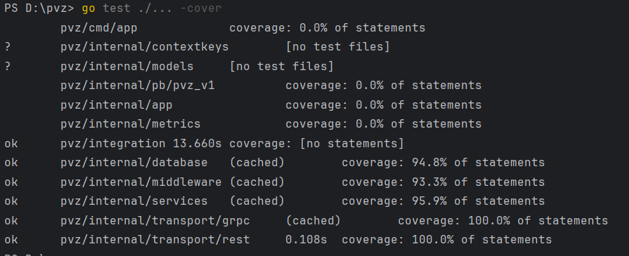
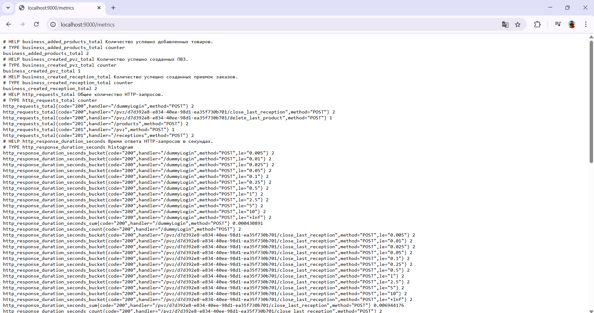

# Как запустить

Выполнить в папке проекта:

```docker-compose up```

# Тесты

Все тесты успешно выполняются, у unit-тестов покрытие 90%+:



Интеграционный тест в [integration](integration) директории.

# Пользовательская авторизация

Пользовательская авторизация реализована по методам /register и /login помимо /dummyLogin

# Логгирование

Уровень логгирования (logrus) настраивается через переменную окружения LOG_LEVEL (используются info, error и fatal).

# gRPC

Реализован один gRPC метод, который возвращает все добавленные в систему ПВЗ. gRPC сервер запущен на порту 3000.

# prometheus

Для числа запросов реализована метрика CounterOpts http_requests_total по {"handler", "method", "code"} запроса.

Для времени выполнения запроса реализована метрика HistogramOpts http_response_duration_seconds по {"handler", "method", "code"} запроса.

Для числа созданных ПВЗ реализована метрика CounterOpts business_created_pvz_total.

Для числа созданых приемок реализована метрика CounterOpts business_created_reception_total.

Для числа добавленных товаров реализована метрика CounterOpts business_added_products_total.

Сервер для prometheus поднят на порту 9000 и отдает данные по ручке /metrics.

